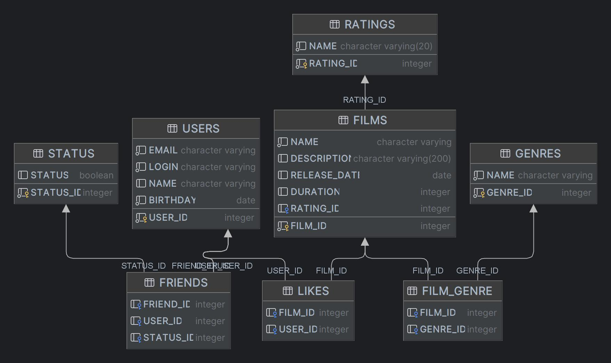

# java-filmorate

##### **_Template repository for Filmorate project._**

### Примеры SQL запросов

#### -- получение таблицы фильмов с количеством жанров

Select f.NAME, count(G2.NAME)\
from FILMS as f\
INNER JOIN FILM_GENRE FG on f.FILM_ID = FG.FILM_ID\
INNER JOIN GENRE G2 on FG.GENRE_ID = G2.GENRE_ID\
group by f.NAME\
ORDER BY COUNT(G2.NAME);

#### -- получение взаимосвязанной таблицы друзей и их статусов и id

SELECT u.NAME, us.NAME, s.STATUS, u.USER_ID, us.USER_ID\
FROM USERS as u\
inner join FRIENDS F on u.USER_ID = F.FRIEND_ID\
inner join STATUS S on F.STATUS_ID = S.STATUS_ID\
inner join USERS us on us.USER_ID = F.USER_ID;

#### -- получение отсортированного списка фильмов по количеству лайков

SELECT F.NAME, COUNT(U.NAME)\
FROM FILMS AS F\
INNER JOIN LIKES L on F.FILM_ID = L.FILM_ID\
LEFT JOIN USERS U on U.USER_ID = L.USER_ID\
GROUP BY F.NAME\
ORDER BY COUNT(U.NAME) desc;

#### --получение списка общих друзей пользователей

SELECT u.user_id, email, login, name, birthday\
FROM FRIENDS as f1\
JOIN FRIENDS as f2 ON f2.FRIEND_ID = f1.FRIEND_ID AND f2.USER_ID = 0\
JOIN USERS U on U.USER_ID = f1.FRIEND_ID\
WHERE f1.USER_ID = 1;